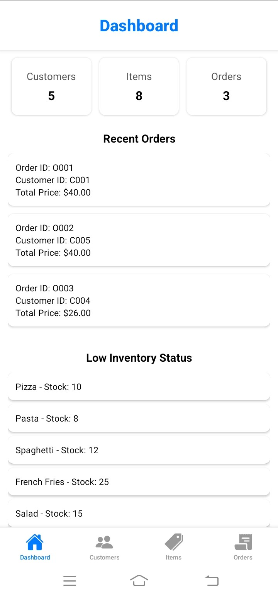
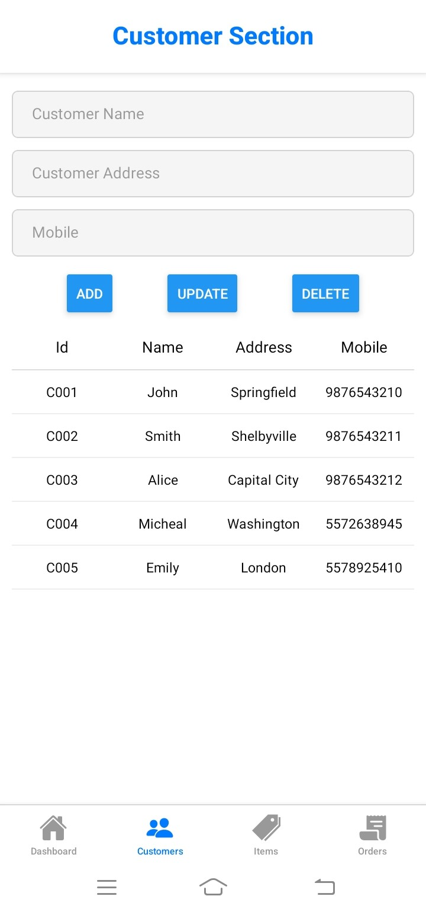
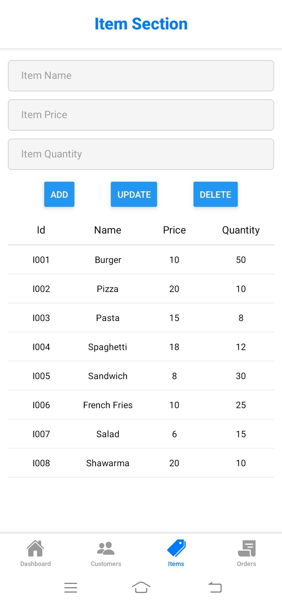
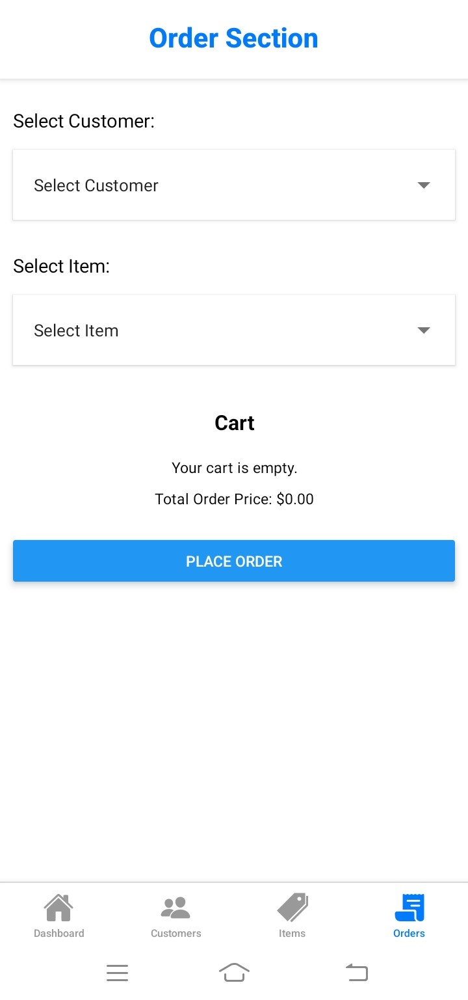
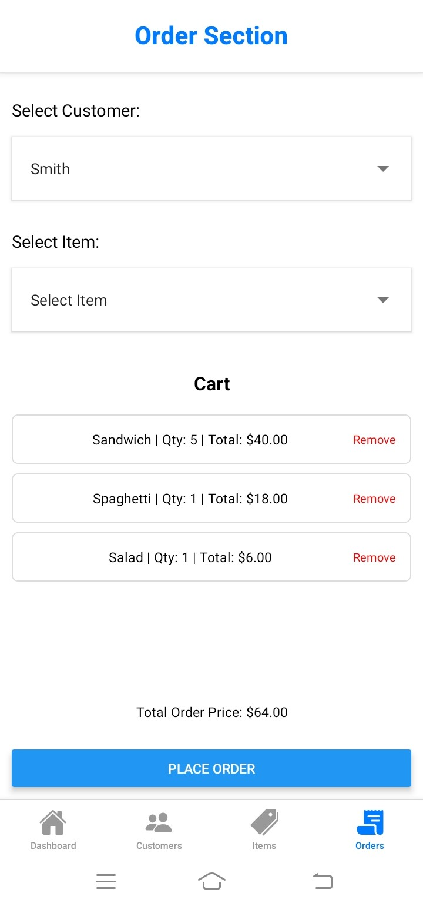

<a href="https://git.io/typing-svg"></a>

<p align="center"></p>

<p id="description">Thogakade Mobile is a React Native-based mobile POS application designed for seamless order management in retail stores. It enables users to manage customers items and orders efficiently with Redux for state management ensuring a smooth and responsive user experience.</p>

<h2>Project Screenshots:</h2>









  
  
<h2>🧐 Features</h2>

Here're some of the project's best features:

*   Customer Management : Add update and delete customer details.
*   Item Management : Manage inventory by adding updating and deleting items.
*   Order Management : Place orders view recent orders and calculate total prices.
*   Dashboard : A centralized view with key metrics recent orders and inventory status.
*   Inventory Status Widget : Highlights items with low stock for better inventory management.
*   Quick Actions : Easily navigate to key sections (e.g. Add Customer Add Item).

<h2>🛠️ Installation Steps:</h2>

<p>1. Clone the Repository</p>

```
https://github.com/sandundil2002/Thogakade_Mobile.git
```

<p>2. Install Dependencies</p>

```
npm install
```

<p>3. Start the Metro Bundler</p>

```
npx react-native start
```

  
  
<h2>💻 Built with</h2>

Technologies used in the project:

*   React Native : Cross-platform mobile app development framework.
*   Redux Toolkit : State management for handling global data like customers items and orders.
*   TypeScript : Adds type safety and improves developer experience.
*   React Navigation : Handles navigation between screens.
*   React Native Paper / Vector Icons : Provides pre-built UI components and icons.
